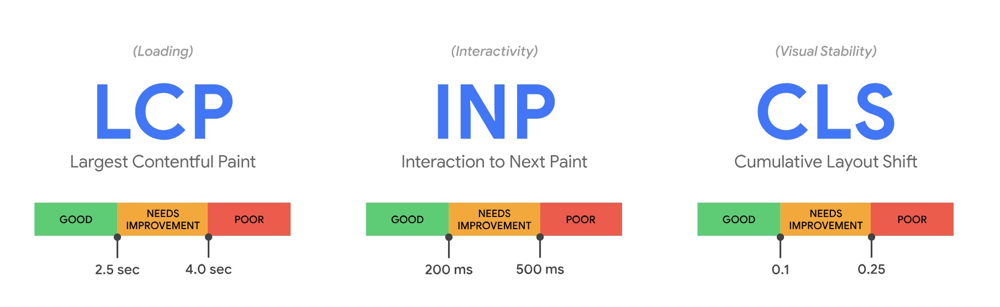
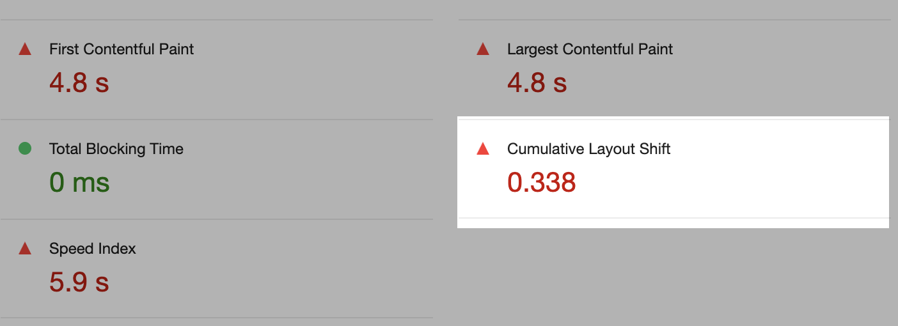
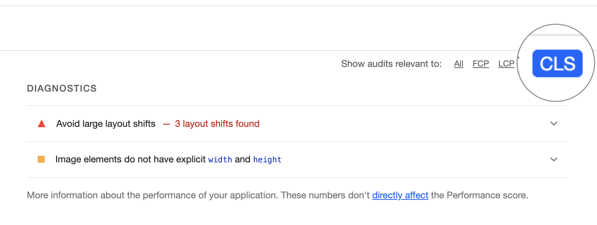
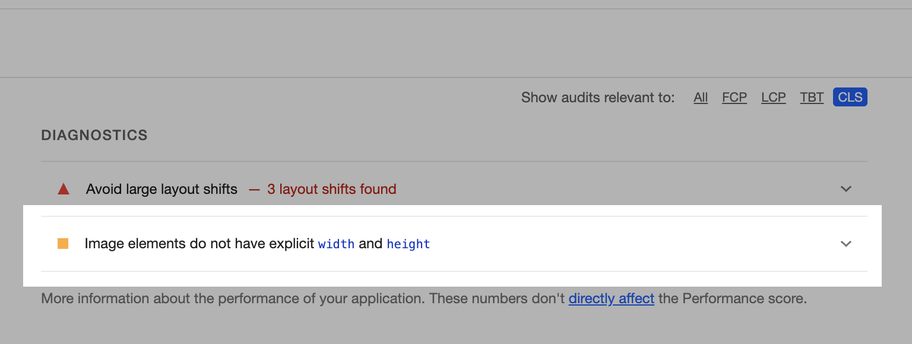
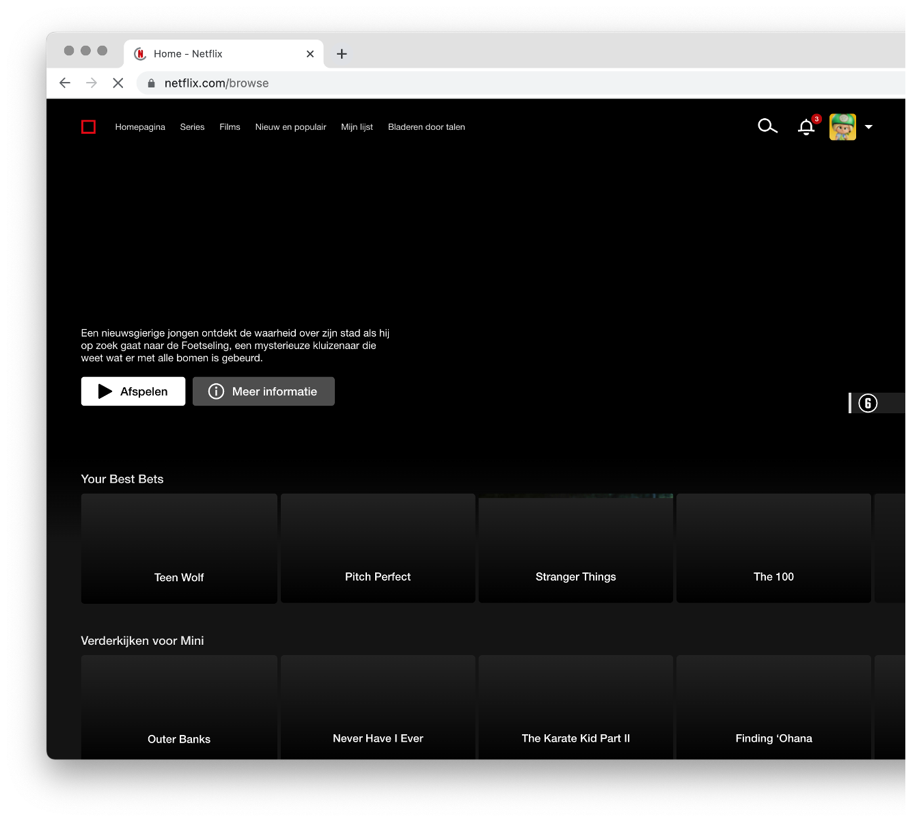
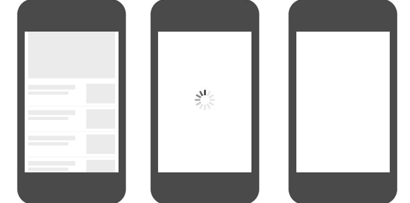

# Enhanced Website

## Layout Shift & Perceived Performance

Over het ontwerpen en bouwen van websites waarbij de layout niet verspringt bij het laden van content.

### Wat is een Layout Shift?

Waarschijnlijk de vervelendste en makkelijkst op te lossen oorzaak van _User Experience_ problemen rondom Performance is de _Layout Shift_.

Als content nadat de pagina geladen en gerenderd is opeens verspringt, spreken we van een Layout Shift:


*Terwijl de gebruiker op de cancel knop wil klikken verspringt de layout waardoor per ongeluk op de bestel button wordt geklikt en de bestelling toch wordt gedaan.*


Layout Shifts worden vaak veroorzaakt door video's of afbeeldingen zonder bekende afmetingen, lettertypes die later inladen en anders renderen dan de fallback, dynamische content die client-side wordt geladen, of bijvoorbeeld advertenties die zichzelf groter of kleiner maken nadat de pagina al geladen is.

Dit zorgt voor een betere user experience en performance zie [#60 Do you prevent layout shifts and repaints](https://www.smashingmagazine.com/2021/01/front-end-performance-2021-free-pdf-checklist/#60) van de Frontend Performance Checklist.


#### Opdracht: Layout-shift nabootsen

🛠️ Maak een kleine `layout-shift` demo in je Learning Journal, waarin je bovenstaand probleem nabootst. We doen het hier bewust “verkeerd”, om te oefenen, en om dit patroon te leren herkennen.

💡 Tip: gebruik bijvoorbeeld `` als je een grote afbeelding wilt laden, of het driestappenplan in client-side JavaScript voor een micro-interactie.

#### Bronnen

- [Cumulative Layout Shift (CLS)](https://web.dev/articles/cls)


### Cumulative Layout Shift

In de [Performance Audit deeltaak](https://github.com/fdnd-task/performance-audit) kwam _Cumulative Layout Shift_ (CLS) ook al langs:



CLS is één van de drie _Core Web Vitals_, waarmee _visuele stabiliteit_ van een pagina gemeten wordt. De CLS score gaat over alle Layout Shifts die op een pagina voorkomen, ook na de initiële render.



De exacte berekening van de score die je krijgt van Lighthouse maakt voor nu niet uit. CLS is een combinatie van verschillende oorzaken, met hetzelfde gevolg: Layout Shifts. En een slechte User Experience.

Het kan best zijn dat CLS problemen worden veroorzaakt door én een groot lettertype, én een advertentie script dat rare dingen doet, én video's die pas laden nadat de pagina geladen is, én een micro-interactie die de content laat springen, én afbeeldingen die geen breedte en hoogte hebben meegekregen, én door de volgorde waarop content geladen wordt.

In de Diagnostics van een Lighthouse rapport vind je de verschillende problemen terug. Als frontender kun je een hoop doen aan deze problemen. Vandaag richten we ons op het oplossen van performance problemen die veroorzaakt worden door Layout Shifts van afbeeldingen.

👍 Let op: het is OK om niet alle problemen in één keer op te lossen. No worries. Als je performance wilt verbeteren, doe je dit met kleine stapjes, en focus je je steeds op één gebied.

Je kunt in Lighthouse filteren op specifieke Web Vitals, wat voor deze opdracht erg handig is.



#### Bronnen

- [Optimize Cumulative Layout Shift](https://web.dev/articles/optimize-cls)
- [Understand the critical path](https://web.dev/learn/performance/understanding-the-critical-path)
- [Lighthouse performance scoring](https://developer.chrome.com/docs/lighthouse/performance/)
- [Web Vitals](https://web.dev/articles/vitals)


### 🛠️ Opdracht: Layout Shifts door afbeeldingen
Doe een Lighthouse Performance test (Mobile) op je eigen project. Liefst op een pagina waar veel afbeeldingen op staan, zodat we wat problemen vinden die we kunnen gaan oplossen. _Throttle_ eventueel je netwerkverbinding (zeker als je op `localhost` test, want dan heb je geen vertraging door het netwerk). Maak een issue aan als je CLS problemen vindt. Analyseer de bevindingen van Lighthouse en voeg screenshots en mogelijke oplossingen of bronnen toe aan je analyse. Geef ook aan op welke pagina of pagina's de problemen plaatsvinden, zodat je weet om welke views het gaan. Performance problemen gaan bijna altijd over problemen in je HTML, en die zul je daar ook op moeten lossen.

💡 Tip: Zijn er verschillende oorzaken voor CLS? Maak dan per oorzaak een sub-issue aan.

Grote kans dat je dit probleem tegen gaat komen:



> Image elements do not have explicit `width` and `height`

In HTML is het goed om altijd `width` _en_ `height` attributen mee te geven aan een `` tag. Dit voelt misschien raar, omdat dit op styling lijkt, maar je geeft de browser hiermee een hint over de _aspect ratio_ van een afbeelding. Hierdoor kan zelfs bij Responsive Design de browser al ruimte reserveren voor een afbeelding. De _render tree_ wordt namelijk gemaakt aan de hand van de HTML én de CSS. Lees voor de details vooral het artikel van Smashing Magazine hieronder.

Als je statische `` tags in je code gebruikt, bijvoorbeeld voor een logo, kun je dit dus makkelijk oplossen, committen, testen, en herhalen voor de volgende afbeelding. Waarschijnlijk heb je hier geen nieuw ontwerp voor nodig, maar je loopt wel meerdere keren de development lifecycle door.

Maar hoe weet je bij dynamische afbeeldingen, uit een database zoals Directus, nou welke afmetingen de afbeeldingen hebben? En hoe zet je die in HTML?

Goed nieuws! Standaard krijg je voor afbeeldingen in Directus alleen het ID terug. `9619c5e5-27a7-4466-b014-ef9527e207cd` bijvoorbeeld. Dit kun je in je Liquid file combineren:

```liquid


```

Je kunt in Directus niet alleen het image ID opvragen, maar via de `fields` query parameter ook alle eigenschappen van de originele afbeelding. Voor de stekjes van Bieb in Bloei kun je dit bijvoorbeeld doen:

```
https://fdnd-agency.directus.app/items/bib_stekjes?fields=foto.id,foto.width,foto.height
https://fdnd-agency.directus.app/items/bib_stekjes?fields=*,foto.id,foto.width,foto.height
https://fdnd-agency.directus.app/items/bib_stekjes?fields=*,foto.*
```

Waardoor je toegang hebt tot wat meer eigenschappen:

```liquid


```

Gebruik het voorbeeld en de bronnen hieronder om je CLS issues rondom je dynamische afbeeldingen op te lossen. Test na elke commit je werk opnieuw, en laat de CLS verbeteringen stap voor stap zien in je issue.

💡 Vergeet ook niet dat je met `console.log()` in NodeJS en het `json` Liquid filter kunt zien wat er in een object zit.

Volgende week gaan we verder met wat meer geavanceerde onderwerpen.

#### Bronnen

- [Setting Height And Width On Images Is Important Again @ Smashing Magazine](https://www.smashingmagazine.com/2020/03/setting-height-width-images-important-again/)
- [Files in Directus](https://directus.io/docs/api/files)
- [Directus Fields](https://directus.io/docs/guides/connect/query-parameters#fields)
- [Liquid json filter](https://liquidjs.com/filters/json.html)


<!-- ## Perceived Performance 
Over lazy loading, loading states en hoe je er voor kan zorgen dat gebruikers een website als snel ervaren.

### Wat is Perceived Performance?

Performance is afhankelijk van hoe snel je mobiel is, hoe snel internet je hebt, hoe snel een server reageert, hoeveel plaatjes of video's op een pagina staan, hoeveel Javascript en fonts geladen moeten worden, ... het ligt er aan ...

Philip Walton schreef in zijn artikel over _user-centric performance_ op [web.dev](https://web.dev/articles/user-centric-performance-metrics):

> Performance is relative.

Door verschillende performance technieken toe te passen kan je ervoor zorgen dat een website sneller laadt. Daarnaast kan je ervoor zorgen dat de gebruiker het *gevoel* heeft dat een website sneller laadt of reageert. Dit noemen we _Perceived Performance_. Dit is het psychologische effect van het wachten. Als je de gebruiker de juiste feedback geeft, zoals loaders, micro-interacties en slimme animaties, zal die het gevoel hebben dat jouw website soepel werkt en snel laadt.

### Skeleton screens
In het artikel [#59 - Have you optimized for perceived performance?](https://www.smashingmagazine.com/2021/01/front-end-performance-2021-free-pdf-checklist/#59) van de Frontend Performance Checklist staan verschillende dingen die je kan doen om de gebruiker het gevoel te geven dat een website sneller werkt, zoals een Skeleton screen tonen.

 
*Netflix Skeleton Screen*

Een Skeleton screen is een lege versie van de pagina, waarin de content zoal plaatjes en video's nog moet worden geladen. Voordat de content geladen wordt, is de outline van de interface al zichtbaar. 
Doordat er snel al iets op de pagina te zien is, krijgen gebruikers het gevoel dat de website sneller laadt.

Let op. Hier moet wel een kanttekening geplaatst worden. Het is namelijk niet altijd dat een skeleton screen als snel ervaren wordt. Er is [onderzoek](https://www.viget.com/articles/a-bone-to-pick-with-skeleton-screens/) gedaan waarbij een _skeleton screen_ en een _loader_ worden vergeleken met een _blank screen_. De uitkomst? Het ligt er aan ... het is niet zo dat een skeleton screen altijd de beste oplossing is.

 
*3 variaties van het laden van een website vergeleken*

### Cheat the UX
Stéphanie Walter vertelt in haar lezing “Cheating The UX When There Is Nothing More To Optimize” dat je in de interface verschillende dingen kan doen die ervoor zorgen dat een gebruiker het gevoel heeft dat de website snel laadt en soepel werkt. Zoals loaders en _progress bars_, _micro-interactions_, _optimistic UI_, _User distractions_ en _progressive asset display_.

#### Visual Time Response voor Interfaces
De _visual time response_ is de tijd die voorbij gaat voordat er iets gebeurt. We onderscheiden 'instant response', 'normal delay', 'system is thinking' en 'do something extra' voor als het (te) lang duurt.

##### Instant response <300ms
Als een interactie niet langer duurt dan 300 milliseconden ervaart de gebruiker dat als 'instant response', de interface reageert direct. Dit geldt voor bijvoorbeeld button states, zoals `:hover` en `:focus`. 

##### Normal Delay 300ms - 2s
Als een interactie of het laden van content sneller gaat dan 2 seconden, is er geen extra feedback nodig. De gebruiker zal dan niet het gevoel krijgen dat iets te lang duurt.

##### System is thinking 2 - 5s
Als het laden van content langer duurt dan 2 seconden, dan zal je de gebruiker feedback moeten even dat er iets gebeurt, een _loading state_.

##### Do something extra >5s
Duurt een interactie of het laden van content langer dan 5 sconden? Dan zul je de gebruiker duidelijk moeten maken waarom iets zo lang duurt. Bijvoorbeeld bij het uploaden van content zorg je ervoor dat in de interface duidelijk is wat er gebeurt en hoe lang het nog duurt.

#### Illusies en slimme animaties 

##### Ease-out animaties 
Gebruik Ease-out animaties als de interface direct moet reageren, zoals voor button states en het menu.

##### Ease-in animaties 
Gebruik Ease-in animaties voor het tonen van informatie zoals prompt, modal, success states en error meldingen.

##### Progress bar
Als je een progress bar naar het einde toe laat versnellen, zal de gebruiker het gevoel krijgen dat iets sneller is geladen.

## Opdracht Perceived Performance
Pas Perceived Performance technieken toe op de client-side code van je POST interactie.

Lees eerst het onderdeel “Have you optimized for perceived performance?” van de Frontend Performance Checklist. Maak aantekeningen in je issue.

Ga daarna ontwerpen in Figma:
- Pas de _Visual Time Response_ toe op de interacties en loading states die je hebt gemaakt in Sprint 9.
- Instant response: Ontwerp de states voor de buttons. Heb je ease-in of ease-out animaties nodig voor de button states?
- System is thinking: Ontwerp de loading animatie in de huisstijl van de opdrachtgever. Voeg zo nodig een skeleton state toe als de content (bijna) geladen wordt.
- Maak een breakdown van de client-side JS en CSS die je nodig hebt. Kan je bedenken hoe je dit kan coderen?
- Build, and have fun!

### Bronnen
- [Have you optimized for perceived performance?- Frontend Performance Checklist #59](https://www.smashingmagazine.com/2021/01/front-end-performance-2021-free-pdf-checklist/#59)
- [Cheating The UX When There Is Nothing More To Optimize, Stéphanie Walter](https://stephaniewalter.design/blog/cheating-ux-perceived-performance-and-user-experience/)
- [A Bone to Pick with Skeleton Screens](https://www.viget.com/articles/a-bone-to-pick-with-skeleton-screens/)

-->
